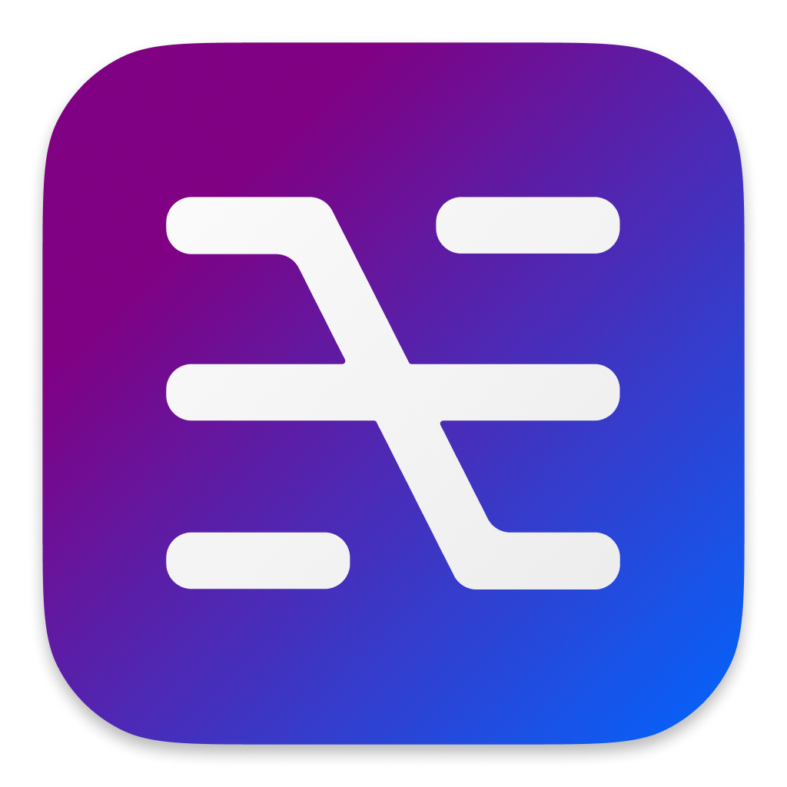

# Optab for macOS


## Usage
This simple app allows for using the Option+Tab hotkey to trigger the macOS app switching menu as well as the existing Cmd+Tab hotkey. The app runs entirely in the background, and does not add any menu bar or dock icons. Exiting requires finding Optab in Activity Monitor and closing it from there. To run Optab on startup, simply add it to the login items in System Preferences.

Optab can be downloaded [here](https://github.com/matthewlipski/alt-tab/releases/tag/v1.1). To install, just move Optab to your Applications folder.

## Building from source
To build Optab from source, first ensure you have Python 3.12 or higher installed. Then, run `init.sh` to initialize the virtual environment and install the required dependencies:
```
source init.sh
```
To build Optab and generate a `.app` executable, run `build.sh`:
```
source build.sh
```
Once complete, you can find the `Optab.app` executable in the `dist` directory.
